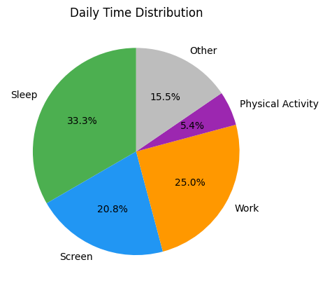
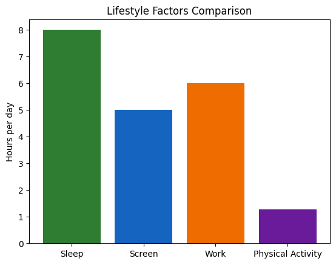
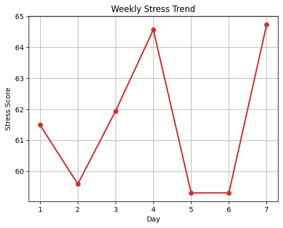
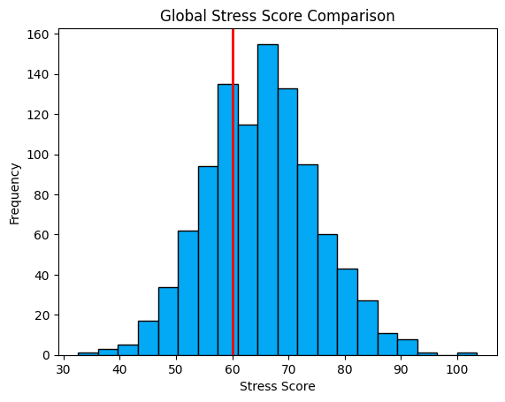
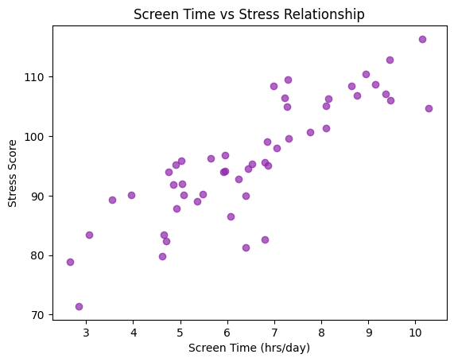
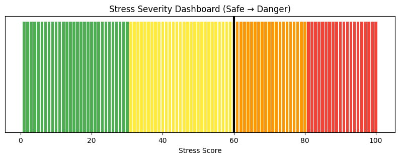

# 🧠 AI-Driven Lifestyle Stress Analysis System


---

## 📌 Project Overview

This project is an **AI-driven lifestyle stress analysis system** that evaluates daily habits such as sleep, screen time, work hours, and physical activity to determine stress levels.

It combines **statistical modeling, visualization, and rule-based intelligence** to generate insights and provide personalized stress management recommendations.

---

## 🎯 Objectives

* Analyze daily lifestyle activities
* Calculate stress score (1–100 scale)
* Classify stress into detailed levels
* Provide AI-based recommendations
* Visualize stress patterns using graphs

---

## 🧠 Technologies Used

* 🐍 Python
* 🔢 NumPy
* 📊 Matplotlib
* 📈 SciPy

---

## 📊 Visualizations Included

| Visualization   | Description               |
| --------------- | ------------------------- |
| 🥧 Pie Chart    | Daily Time Distribution   |
| 📊 Bar Chart    | Lifestyle Comparison      |
| 📈 Line Graph   | Weekly Stress Trend       |
| 📉 Histogram    | Global Stress Comparison  |
| 🔵 Scatter Plot | Screen Time vs Stress     |
| 🌈 Dashboard    | Stress Severity Indicator |

---

## 📸 Sample Outputs








---

## ⚙️ How to Run the Project

```bash
# Clone the repository
git clone https://github.com/yashbajaj02/AI-Stress-Analysis-System.git

# Install dependencies
pip install -r requirements.txt

# Run the project
python stress_analysis.py
```

---

## 🧠 AI Insight

The system provides intelligent suggestions based on stress levels:

* ✅ Low stress → Maintain routine
* ⚠️ Medium stress → Improve habits
* 🔥 High stress → Immediate action
* 🚨 Critical stress → Professional help

---

## 🚀 Future Improvements

* 🌐 Convert into Streamlit Web App
* 📱 Mobile integration
* ⌚ Wearable device data integration
* 🤖 Machine Learning-based prediction

---

## 🎤 Viva Line

> “Clear execution steps improve reproducibility of the project.”

---

## 👨‍💻 Author

**Yash Bajaj**
